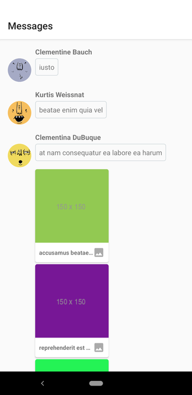
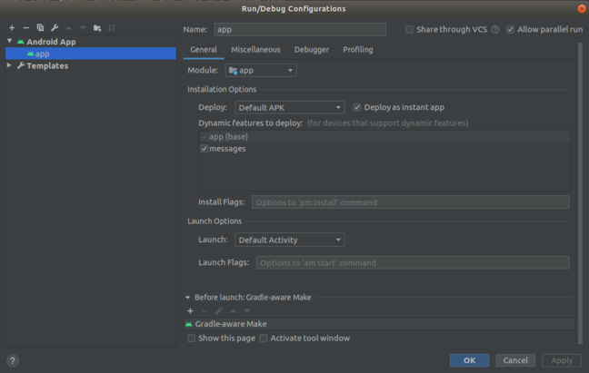

# Talko
A sample messaging UI app for Android writen in Kotlin with a working local persistence layer.

# Working

Video demo can be seen [here](https://drive.google.com/file/d/11LWryPTnveaMwdqTQZu4HyY0GXpZHNf2/view?usp=sharing)

# Running
You will need a device with API 27+ to run the Instant app.

# Architecture
* MVVM with Observable pattern
* A modular app with Instant Apps

# Decisions
* **Room vs Realm vs ObjectBox** - We needed a performant relational database that performed well with ReactiveExtensions. In the above combination, Room performs the best.
* **Too many delegates?** - We have created a delegate each for sender name, message, attachment and the same for recievers. This is done to make use of the recycling capabilities of RecyclerView and to be able to easily add functionality to a particular item.
* **Rx vs Coroutines** - Rx worked well for us to create a stream a data to be passed from our local storage, manipulate it and pass it to our UI.
* **Adapter delegate vs Epoxy vs Groupie** - Adapter Delegates works with `ListAdapter` and performs diffing of our lists on a background thread giving us optimum performance.

# Contains
* **[Dagger 2](https://dagger.dev/)**: Dependency injection
* **[Reactive streams](https://github.com/ReactiveX/RxJava)**: Networking, Local persistance, Stream manipulation & Async.
* **[LiveData and ViewModel](https://developer.android.com/topic/libraries/architecture)**: Isolate business logic and maintain state.
* **[Room](https://developer.android.com/topic/libraries/architecture/room)**: Local persistance
* **[Adapter Delegates](https://github.com/sockeqwe/AdapterDelegates)**: For easier multi-view `RecyclerView` with DiffUtils.

# To-do
* Add test cases : Combination of UI and integration tests from [karntrehan/Starwars](https://github.com/karntrehan/Starwars) and [karntrehan/Posts](https://github.com/karntrehan/Posts/)

# Licence
    MIT License

    Copyright (c) 2019 Karan Trehan
    
    Permission is hereby granted, free of charge, to any person obtaining a copy
    of this software and associated documentation files (the "Software"), to deal
    in the Software without restriction, including without limitation the rights
    to use, copy, modify, merge, publish, distribute, sublicense, and/or sell
    copies of the Software, and to permit persons to whom the Software is
    furnished to do so, subject to the following conditions:
    
    The above copyright notice and this permission notice shall be included in all
    copies or substantial portions of the Software.
    
    THE SOFTWARE IS PROVIDED "AS IS", WITHOUT WARRANTY OF ANY KIND, EXPRESS OR
    IMPLIED, INCLUDING BUT NOT LIMITED TO THE WARRANTIES OF MERCHANTABILITY,
    FITNESS FOR A PARTICULAR PURPOSE AND NONINFRINGEMENT. IN NO EVENT SHALL THE
    AUTHORS OR COPYRIGHT HOLDERS BE LIABLE FOR ANY CLAIM, DAMAGES OR OTHER
    LIABILITY, WHETHER IN AN ACTION OF CONTRACT, TORT OR OTHERWISE, ARISING FROM,
    OUT OF OR IN CONNECTION WITH THE SOFTWARE OR THE USE OR OTHER DEALINGS IN THE
    SOFTWARE.    